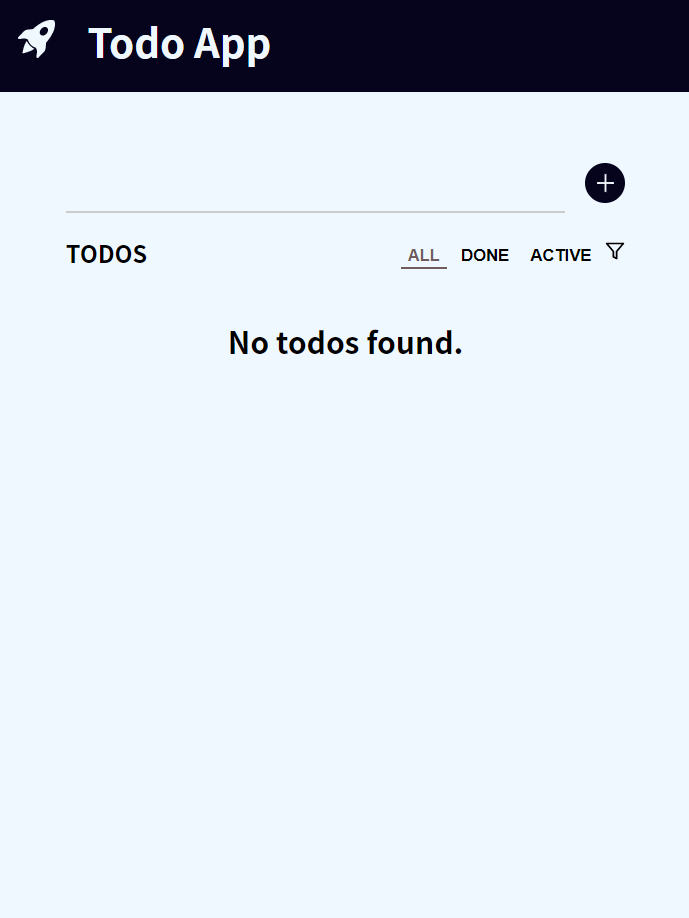

# TODO APP
This simple todo app
- adds tasks
- deletes tasks
- marks as complete selected tasks
- filters by completed tasks.

## Requirenments
- [Node.js](https://nodejs.org/)

## Project Details
- [React](https://reactjs.org/)
- [Context API](https://reactjs.org/docs/context.html) for state management
- Local Storage

<div align="left">
  
  
  
</div>

## Usage

In the project directory, you can run:

### Install dependencies

```
npm install
```
Downloads dependencies defined in a package.json file and generates a node_modules folder with the installed modules.

### Run React development server

```
npm start
```

Runs the app in the development mode.\
Open [http://localhost:3000](http://localhost:3000) to view it in your browser.

### Deployment

```
npm run build
```

Builds the app for production to the `build` folder.